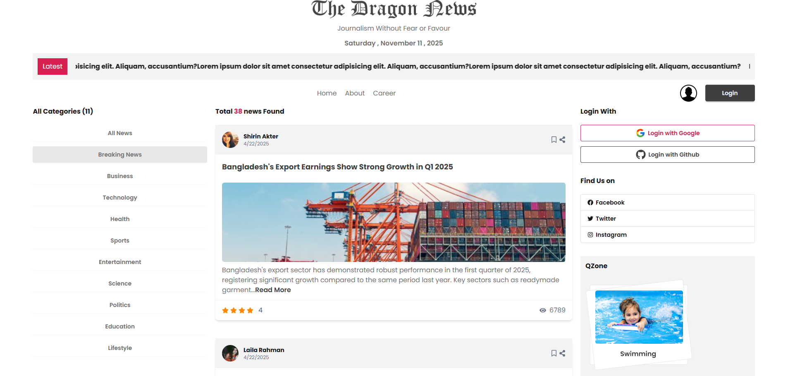

# Dragon News



A modern, responsive news portal application built with React. This project provides a clean and intuitive interface for browsing news articles across various categories.

**Live Demo:** [https://dragon-news-sami.netlify.app](https://dragon-news-sami.netlify.app)

---

## About The Project

Dragon News is a front-end web application that simulates a real-world news website. It features a homepage with the latest news, category-based filtering, and a clean layout for readability. The project is built with modern web technologies and demonstrates best practices in React development, including component-based architecture and routing.

---

## Features

-   **Latest News Ticker:** A scrolling marquee on the homepage displays breaking news headlines.
-   **Category-Based Filtering:** Users can easily navigate and filter news articles by predefined categories.
-   **Responsive Design:** The layout is fully responsive and optimized for a seamless experience on desktops, tablets, and mobile devices.
-   **Component-Based Architecture:** The codebase is organized into reusable and maintainable React components.
-   **Static Data:** News and category data are served from local JSON files, making the project easy to run without a backend dependency.
-   **Social Integration:** Includes UI components for social media links and social login options.

---

## Technologies Used

This project was bootstrapped with [Vite](https://vitejs.dev/) and built using the following core technologies:

-   **[React](https://reactjs.org/)**: A JavaScript library for building user interfaces.
-   **[React Router](https://reactrouter.com/)**: For declarative routing in the React application.
-   **[Tailwind CSS](https://tailwindcss.com/)**: A utility-first CSS framework for rapid UI development.
-   **[DaisyUI](https://daisyui.com/)**: A component library for Tailwind CSS to build beautiful UIs quickly.
-   **[React Fast Marquee](https://www.react-fast-marquee.com/)**: For the scrolling news ticker.
-   **[React Icons](https://react-icons.github.io/react-icons/)**: For including popular icons in the project.
-   **[date-fns](https://date-fns.org/)**: For modern JavaScript date utilities.

---

## Getting Started

To get a local copy up and running, follow these simple steps.

### Prerequisites

You need to have Node.js and npm installed on your machine.
-   [Node.js](https://nodejs.org/en/)
-   [npm](https://www.npmjs.com/get-npm)

### Installation

1.  **Clone the repository:**
    ```sh
    git clone https://github.com/your-username/dragon-news-with-router-main.git
    ```
2.  **Navigate to the project directory:**
    ```sh
    cd dragon-news-with-router-main
    ```
3.  **Install NPM packages:**
    ```sh
    npm install
    ```
4.  **Start the development server:**
    ```sh
    npm run dev
    ```
    Your application should now be running on `http://localhost:5173` (or the next available port).

---

## Available Scripts

In the project directory, you can run:

-   `npm run dev`: Runs the app in the development mode.
-   `npm run build`: Builds the app for production to the `dist` folder.
-   `npm run lint`: Lints the code using ESLint to find and fix problems.
-   `npm run preview`: Serves the production build locally to preview it.

---

## Contributing

Contributions are what make the open-source community such an amazing place to learn, inspire, and create. Any contributions you make are **greatly appreciated**.

If you have a suggestion that would make this better, please fork the repo and create a pull request. You can also simply open an issue with the tag "enhancement".

1.  Fork the Project
2.  Create your Feature Branch (`git checkout -b feature/AmazingFeature`)
3.  Commit your Changes (`git commit -m 'feat: Add some AmazingFeature'`)
4.  Push to the Branch (`git push origin feature/AmazingFeature`)
5.  Open a Pull Request

---

## License

Distributed under the MIT License. See `LICENSE` for more information. (Note: You may need to create a LICENSE file if one doesn't exist).